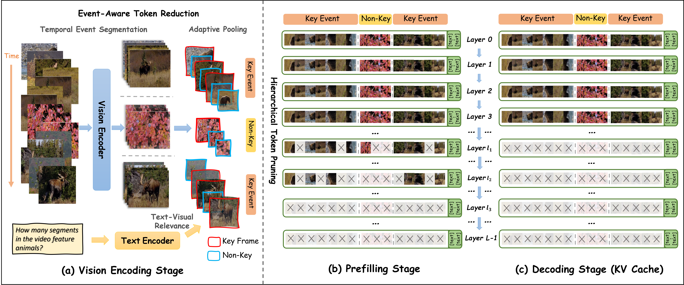

<div align="center">

<h1> METok: Multi-Stage Event-based Token Compression for Efficient Long Video Understanding </h1>

<h5 align="center"> 

Mengyue Wang, Shuo Chen, Kristian Kersting, Volker Tresp, Yunpu Ma<sup>†</sup>

(†) corresponding author

Arxiv preprint at [2506.02850](https://arxiv.org/abs/2506.02850)

</h5>
</div>



## 👀 Abstract

Recent advances in Video Large Language Models (VLLMs) have significantly enhanced their ability to understand video content. Nonetheless, processing long videos remains challenging due to high computational demands and the redundancy present in the visual data. In this work, we propose METok, a training-free, Multi-stage Event-based Token compression framework designed to accelerate VLLMs' inference while preserving accuracy. METok progressively eliminates redundant visual tokens across three critical stages: (1) event-aware compression during vision encoding, (2) hierarchical token pruning in the prefilling stage based on semantic alignment and event importance, and (3) a decoding-stage KV Cache optimization that further reduces memory consumption. Our experiments on diverse video benchmarks demonstrate that METok achieves an optimal trade-off between efficiency and accuracy by dynamically selecting informative visual tokens. For instance, equipping LongVA-7B with METok realizes an 80.6% FLOPs reduction and 93.5% KV Cache memory savings, all while maintaining comparable or even superior accuracy.


## 👨‍💻 Preparation

1. Clone this repository and navigate to METok folder
```bash
git clone https://github.com/mnyuew/METok.git
cd METok
```

2. Install necessary package
```Shell
conda create -n METok python=3.10 -y
conda activate METok
pip install --upgrade pip  # Enable PEP 660 support.
pip install -e ".[train]"
```
## 🎯 Usage
### Run an example

We provide an example with LLaVA-OneVisio-7B model to inference on a video with or without METok in `script/playground/demo/example_metok.py`.

```bash
python script/playground/demo/example_metok.py
```
### Evaluations

We use [lmms-eval](https://github.com/EvolvingLMMs-Lab/lmms-eval/tree/main) to evaluate METok, please follow the detailed instruction in its repository.

#### Example
```bash
python3 -m accelerate.commands.launch \
        --num_processes=8 \
        --module lmms_eval \
        --model llava_onevision \
        --model_args "pretrained=lmms-lab/llava-onevision-qwen2-7b-ov,conv_template=qwen_1_5,model_name=llava_qwen,pruning_layers=$pruning_layer,prune_threshold=$prune_threshold,ratio=$ratio" \
        --tasks mvbench \
        --batch_size 1 \
        --log_samples \
        --log_samples_suffix llava_onevision_demo \
        --output_path "$output_path"
```


## License
This project is released under the [Apache 2.0 license](LICENSE).


## Acknowledgment

We extend our gratitude to the open-source efforts of [LLaVA-NeXT](https://github.com/LLaVA-VL/LLaVA-NeXT)

## Citation

If you find this work helpful, please consider citing our paper
```bibtex
@article{wang2025metok,
  title={METok: Multi-Stage Event-based Token Compression for Efficient Long Video Understanding},
  author={Wang, Mengyue and Chen, Shuo and Kersting, Kristian and Tresp, Volker and Ma, Yunpu},
  journal={arXiv preprint arXiv:2506.02850},
  year={2025}
}

```